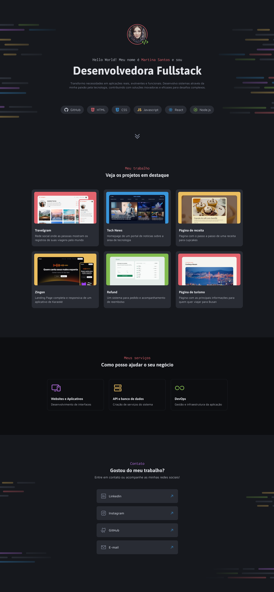

# Portfólio Desenvolvedor

___

### Criação de uma página exemplo de um portfólio!

Este projeto foi desenvolvido para treinar habilidades em **HTML** e **CSS**, com o objetivo de criar uma página atrativa e adaptável utilizando as propriedades de **Flex-box** no CSS. O design foi programado a partir de um projeto no **Figma** e implementado com foco em boas práticas de codificação.

---

## Sobre o Projeto

A página tem como propósito promover os projetos de um desenvolvedor de software, destacando informações relevantes com um layout moderno e agradável.

---

## Funcionalidades

- **Layout Atraente:** Elementos estilizados com transições suaves, garantindo uma navegação intuitiva.
- **Estrutura Clareada:** Divisão em seções bem definidas para facilitar a leitura e a interação.

---

## Tecnologias Utilizadas

- **HTML5**: Estruturação do conteúdo.
- **CSS3**: Estilização da página e implementação de responsividade.
- **Figma**: Prototipagem do design.

---

## Visualização do Projeto

Confira o layout da página:

---

Feito com :heart: por Tiago Marques.